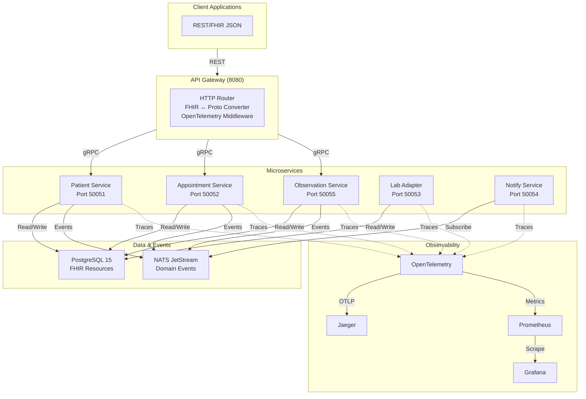

# CareFlow-Mini

A production-ready healthcare microservices reference architecture demonstrating modern cloud-native engineering patterns, FHIR R4 compliance, and comprehensive observability.

## Overview

CareFlow-Mini implements a patient journey from registration through appointment scheduling and lab result ingestion. It showcases real-world patterns for building scalable, observable microservices: gRPC for internal communication, REST API for external clients, PostgreSQL for storage, NATS for events, and OpenTelemetry for tracing.

Ideal for learning distributed systems design or as a reference for healthcare platform development.

## Quick Start

```bash
git clone https://github.com/Sotiris-Bekiaris/careflow-mini.git
cd careflow-mini

make docker-up    # Start infrastructure
make run-dev      # Build and run all services
```

Access the system:
- API: http://localhost:8080
- Jaeger: http://localhost:16686
- Grafana: http://localhost:3000 (admin/admin)
- Prometheus: http://localhost:9090

## Architecture



## Services

| Service | Port | Purpose |
|---------|------|---------|
| API Gateway | 8080 | REST API, routes to gRPC services, traces requests |
| Patient Service | 50051 | CRUD operations for patients |
| Appointment Service | 50052 | Appointment scheduling and cancellation |
| Observation Service | 50055 | Lab results and clinical measurements |
| Lab Adapter | 50053 | HL7 v2.x parser, maps to FHIR Observation |
| Notify Service | 50054 | Event consumer for notifications |

## Technology Stack

- **Language**: Go 1.24+
- **Service Communication**: gRPC + Protocol Buffers (internal), REST + JSON (external)
- **Database**: PostgreSQL 15 with JSONB columns
- **Events**: NATS JetStream with durable consumers
- **Tracing**: OpenTelemetry → Jaeger
- **Metrics**: Prometheus + Grafana
- **Testing**: testcontainers-go for integration tests
- **Frontend**: Vue 3 + TypeScript + Pinia + Vuetify
- **Containerization**: Docker, Docker Compose, Helm

## Development

### Requirements
Go 1.24+, Docker, Docker Compose, Make

### Build Targets

```bash
make build        # Compile all services
make test         # Run tests with race detection
make lint         # Format and lint
make proto        # Generate protobuf code
make run-dev      # Full development environment
make stop-dev     # Stop all services
```

### Testing

```bash
# All tests
go test -v -race -cover ./...

# Specific package
go test -v ./internal/patient/...

# With coverage report
go test -coverprofile=coverage.out ./...
go tool cover -html=coverage.out
```

## Project Structure

```
cmd/                    # Service entry points
internal/               # Service layers (handler, service, repository)
pkg/                    # Shared packages (db, events, fhir, hl7, observability)
proto/                  # Protocol Buffer definitions
web/                    # Vue 3 frontend
deploy/                 # Docker Compose, Helm charts
scripts/                # DB initialization, demo scripts
.github/workflows/      # CI/CD pipeline
```

## Data Model

**FHIR Resources** (stored as JSONB in PostgreSQL):
- Patient - Demographics, identifiers, contact info
- Appointment - Scheduled encounters with status
- Observation - Lab results and clinical measurements

**Domain Events** (published to NATS):
- `patient.created`, `patient.updated`, `patient.deleted`
- `appointment.created`, `appointment.cancelled`
- `observation.created`

## API

REST endpoints follow FHIR conventions:

```bash
# Patients
GET/POST        /fhir/Patient
GET/PUT/DELETE  /fhir/Patient/{id}

# Appointments
GET/POST        /fhir/Appointment
DELETE          /fhir/Appointment/{id}

# Observations
GET/POST        /fhir/Observation
GET             /fhir/Observation/{id}

# Health
GET             /health    # Liveness
GET             /ready     # Readiness
```

Full API docs in `docs/` directory.

## Deployment

### Local Development
```bash
make docker-up    # Start infrastructure (Postgres, NATS, observability)
make run-dev      # Build and run services
```

### Kubernetes
```bash
helm install careflow deploy/helm/ \
  --namespace careflow \
  --create-namespace
```

### Configuration

All services use environment variables:

```bash
# Database
DB_HOST=localhost
DB_PORT=5432
DB_USER=careflow
DB_PASSWORD=careflow_dev
DB_NAME=careflow

# NATS
NATS_URL=nats://localhost:4222

# Observability
OTEL_EXPORTER_OTLP_ENDPOINT=http://localhost:4318

# Service addresses (for API Gateway)
PATIENT_SVC_ADDR=localhost:50051
APPOINTMENT_SVC_ADDR=localhost:50052
OBSERVATION_SVC_ADDR=localhost:50055
```

## Observability

- **Jaeger** (http://localhost:16686) - Distributed tracing across services
- **Prometheus** (http://localhost:9090) - Metrics scraping and querying
- **Grafana** (http://localhost:3000) - Dashboards and visualization
- **Health Checks** - `/health` and `/ready` endpoints, gRPC health protocol

All services automatically instrumented with OpenTelemetry. Traces show request paths through multiple services with latency breakdowns.

## Testing & Quality

- Table-driven unit tests for all business logic
- Integration tests with testcontainers for real dependencies
- CI/CD pipeline: lint → test → buf validation → build → security scan → smoke tests
- 80%+ test coverage across packages

## Security

**Development Focus**: This is a reference implementation. For production healthcare systems:

- Implement TLS/mTLS for all service communication
- Add authentication (OAuth 2.0/OIDC) and authorization (RBAC)
- Enable audit logging for data access
- Encrypt data at rest and in transit
- Implement rate limiting and input validation
- Use secrets management systems (not env vars for production)
- Ensure HIPAA compliance for real patient data

See `docs/security.md` for detailed security architecture.

## Contributing

1. Fork the repository
2. Create a feature branch
3. Follow Go conventions, write tests
4. Ensure `make test` and `make lint` pass
5. Submit PR with clear description

Use conventional commits for messages.

## Documentation

- **Architecture Decision Records** - `docs/adr/` - Design rationales and trade-offs
- **Runbook** - `docs/runbook.md` - Operational procedures
- **Deployment** - `docs/deployment.md` - Cloud deployment patterns
- **Security** - `docs/security.md` - Security architecture and recommendations

## Performance

- Simple operations (patient lookup): 20-50ms
- Complex workflows (create + publish event): 100-200ms
- HL7 parsing: 5-10ms per message

Horizontal scaling: Deploy multiple service instances behind a load balancer. Stateless services scale linearly. Database connection pooling and NATS handle increased throughput.

## License

Apache License 2.0. See [LICENSE](LICENSE) for details.

## Support

- **Issues**: Report bugs and request features on GitHub
- **Discussions**: Ask questions and discuss architecture on GitHub Discussions
- **Security**: Report vulnerabilities privately to maintainers

## Roadmap

- Expanded FHIR resource support (Medication, Procedure, Condition, etc.)
- Additional HL7 message types (ADT, ORM, etc.)
- Multi-tenant support
- Machine learning for anomaly detection
- Reference implementations in Rust and Python